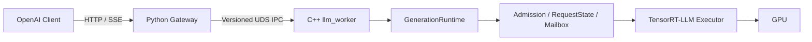
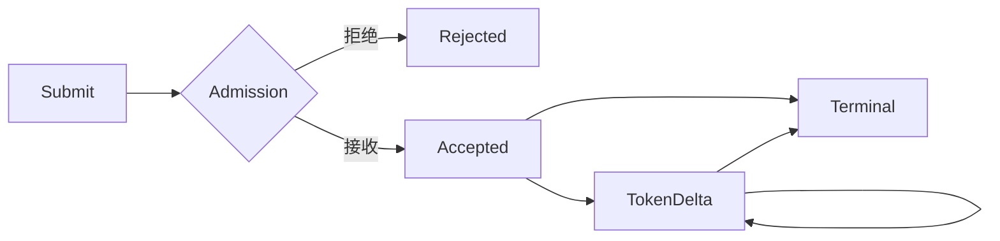
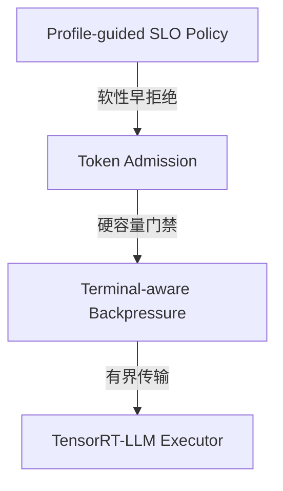

# 基于 TensorRT-LLM 的LLM推理服务框架

`kim-llm-serving` 是一个使用 C++17 和 TensorRT-LLM Executor 实现的 LLM Serving Runtime，提供 OpenAI-compatible HTTP/SSE 接口，重点解决请求生命周期、并发安全、资源治理、流式输出和故障收敛。

项目采用 Python Gateway 与独立 C++ Worker 的双进程架构。连续批处理、Paged KV Cache 和模型执行调度由 TensorRT-LLM 提供，本项目负责其上的服务数据面。



## 特性

### 1. Gateway 与 Worker 进程隔离

模块见 `gateway/python`、`src/worker` 和 `src/ipc`。TensorRT-LLM、TensorRT、MPI 和 CXX11 ABI 0 只存在于独立 Worker 中，Python Gateway 不加载 GPU Runtime。

Gateway 负责 HTTP/SSE、Tokenizer 和增量 Detokenizer；Worker 负责推理、请求状态机和资源治理。两者通过 `UDS + 长度前缀 + 严格 JSON` 通信，并使用 `protocol_version`、`worker_epoch`、`request_id` 和 `ModelManifest` 防止协议与模型配置漂移。

### 2. 唯一终态请求生命周期

模块见 `src/runtime/request_state.cpp`、`src/runtime/generation_runtime.cpp` 和 `src/worker/runtime_bridge.cpp`。



- Accepted 请求在传输存活时最终恰好产生一个 Terminal；
- Rejected 请求不进入活动生命周期；
- Terminal 后不再交付 Token；
- Admission 资源通过 RAII Lease 恰好释放一次。

取消、超时、背压、Worker 断连和优雅停止共用同一终态门禁。

### 3. 端到端有界流控

模块见 `src/runtime/generation_mailbox.cpp`、`src/worker/session_egress.cpp` 和 `gateway/python/kim_llm_gateway/runtime.py`。

请求数、输入 Token、预留输出 Token、Mailbox、IPC 帧、Session Egress 和 SSE 队列均有显式上限。Worker 使用控制队列和请求级队列公平轮转：普通 Token 不能占用 Terminal 保留容量，单个慢请求拥塞时只取消该请求，不阻塞其他请求。

### 4. 分层过载治理



三层分别处理性能风险、GPU 资源安全和传输可靠性。Profile-guided 策略在当前场景下存在下过早拒绝现象，待完善。

## 验证结果

测试环境为 RTX 3060、TinyLlama 1.1B FP16、TensorRT-LLM 0.16.0 和 TensorRT 10.7.0.23。

| 验证项 | 结果 |
|---|---|
| CPU-only 构建与契约测试 | `17/17 PASS`，已接入 CI |
| 完整 CPU + GPU 门禁 | `19/19 PASS` |
| IPC 相对 Direct | TTFT P50 `+0.797 ms`，E2E P50 `+2.686 ms` |
| HTTP 相对 IPC | TTFT P50 `+1.915 ms`，E2E P50 `+2.918 ms` |
| Token Budget 过载实验 | 24/32 RPS 下 E2E P95 由 `425/426 ms` 降至 `305/314 ms` |
| 慢客户端隔离 | 健康请求 `339/339` 满足 SLO，TTFT P95 增加 `0.572 ms` |

当前实验均固定模型、Engine、GPU、workload 和提交，并重复三轮以上。结果位于 `benchmark/evidence`。

## 构建与测试

CPU-only 路径不依赖 CUDA、TensorRT 或真实 Engine：

```bash
python3 -m pip install -r gateway/python/requirements.txt "httpx>=0.27,<1"
./kim-llm test
```

GPU 路径需要 TensorRT-LLM 0.16.0、TensorRT 10.7.0.23 和 CXX11 ABI 0：

```bash
./kim-llm test --gpu \
  --trtllm-source-dir /path/to/TensorRT-LLM \
  --trtllm-lib-dir /path/to/tensorrt_llm/libs \
  --tensorrt-root /path/to/TensorRT \
  --engine-dir /path/to/engine
```

统一入口还提供服务与三路径 Benchmark：

```bash
./kim-llm serve --gateway-config configs/gateway.local.json
./kim-llm benchmark --engine-dir /path/to/engine --tokenizer-path /path/to/tokenizer
```

使用 `./kim-llm --help` 查看完整参数。

## 当前范围

当前版本支持单机、单 GPU、单模型和单活 Gateway Session。

## TODO
多 Worker 路由、多 GPU、动态多模型、Tool Calling、鉴权或 TLS。