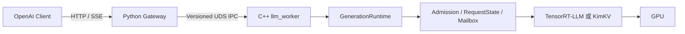
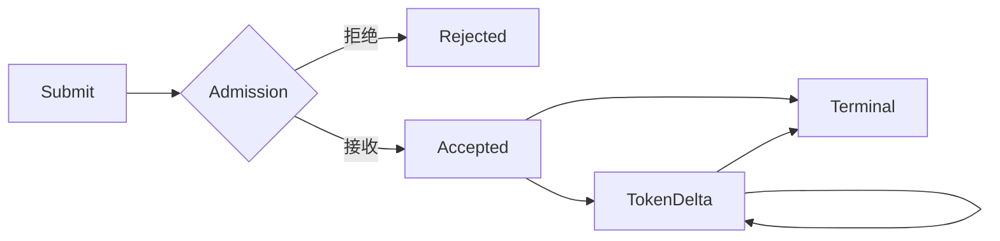
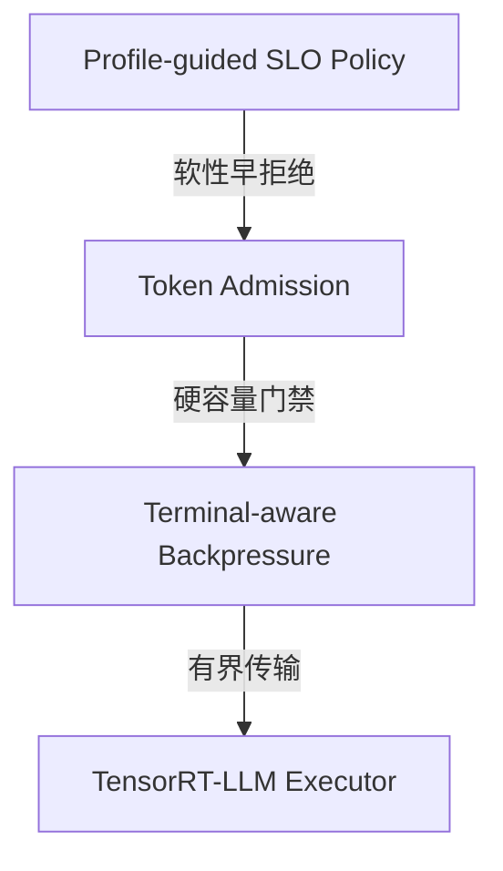

# kim-llm-serving 推理服务框架

`kim-llm-serving` 是一个 C++17 LLM Serving Runtime，提供 OpenAI-compatible HTTP/SSE 接口，重点解决请求生命周期、并发安全、资源治理、流式输出和故障收敛。Worker 可选用 TensorRT-LLM Executor 或 `kim-llm-runtime` 的 KimKV 后端。

项目采用 Python Gateway 与独立 C++ Worker 的双进程架构。选用 TensorRT-LLM 时，连续批处理、Paged KV Cache 和模型调度由其 Executor 提供；选用 KimKV 时，由相邻的 `kim-llm-runtime` 仓库提供调度、KV 和 CUDA 模型执行。


```mermaid
graph LR
    A[OpenAI Client] -->|HTTP / SSE| B[Python Gateway]
    B -->|Versioned UDS IPC| C[C++ llm_worker]
    C --> D[GenerationRuntime]
    D --> E[Admission / RequestState / Mailbox]
    E --> F[TensorRT-LLM 或 KimKV]
    F --> G[GPU]
```

## 特性

### 1. Gateway 与 Worker 进程隔离

模块见 `gateway/python`、`src/worker` 和 `src/ipc`。TensorRT-LLM、TensorRT、MPI 和 CXX11 ABI 0 只存在于独立 Worker 中，Python Gateway 不加载 GPU Runtime。

Gateway 负责 HTTP/SSE、Tokenizer 和增量 Detokenizer；Worker 负责推理、请求状态机和资源治理。两者通过 `UDS + 长度前缀 + 严格 JSON` 通信，并使用 `protocol_version`、`worker_epoch`、`request_id` 和 `ModelManifest` 防止协议与模型配置漂移。

### 2. 唯一终态请求生命周期

模块见 `src/runtime/request_state.cpp`、`src/runtime/generation_runtime.cpp` 和 `src/worker/runtime_bridge.cpp`。


```mermaid
graph LR
    A[Submit] --> B{Admission}
    B -->|拒绝| C[Rejected]
    B -->|接收| D[Accepted]
    D --> E[TokenDelta]
    E --> E
    D --> F[Terminal]
    E --> F
```

- Accepted 请求在传输存活时最终恰好产生一个 Terminal；
- Rejected 请求不进入活动生命周期；
- Terminal 后不再交付 Token；
- Admission 资源通过 RAII Lease 恰好释放一次。

取消、超时、背压、Worker 断连和优雅停止共用同一终态门禁。

### 3. 端到端有界流控

模块见 `src/runtime/generation_mailbox.cpp`、`src/worker/session_egress.cpp` 和 `gateway/python/kim_llm_gateway/runtime.py`。

请求数、输入 Token、预留输出 Token、Mailbox、IPC 帧、Session Egress 和 SSE 队列均有显式上限。Worker 使用控制队列和请求级队列公平轮转：普通 Token 不能占用 Terminal 保留容量，单个慢请求拥塞时只取消该请求，不阻塞其他请求。

### 4. 分层过载治理


```mermaid
graph TD
    A[Profile-guided SLO Policy] -->|软性早拒绝| B[Token Admission]
    B -->|硬容量门禁| C[Terminal-aware Backpressure]
    C -->|有界传输| D[TensorRT-LLM Executor]
```

三层分别处理性能风险、GPU 资源安全和传输可靠性。Profile-guided 策略在当前场景下存在下过早拒绝现象，待完善。

## 验证结果

测试环境为 RTX 3060、TinyLlama 1.1B FP16、TensorRT-LLM 0.16.0 和 TensorRT 10.7.0.23。

| 验证项 | 结果 |
|---|---|
| CPU-only 构建与契约测试 | `17/17 PASS`，已接入 CI |
| 完整 CPU + GPU 门禁 | `19/19 PASS` |
| IPC 相对 Direct | TTFT P50 `+0.797 ms`，E2E P50 `+2.686 ms` |
| HTTP 相对 IPC | TTFT P50 `+1.915 ms`，E2E P50 `+2.918 ms` |
| Token Budget 过载实验 | 24/32 RPS 下 E2E P95 由 `425/426 ms` 降至 `305/314 ms` |
| 慢客户端隔离 | 健康请求 `339/339` 满足 SLO，TTFT P95 增加 `0.572 ms` |

表中 GPU 性能数据来自 TensorRT-LLM 后端，固定模型、Engine、GPU、workload 和提交，并重复三轮以上。结果位于 `benchmark/evidence`；不代表 KimKV 后端性能。

## KimKV 后端接入

KimKV 后端的构建、配置和后续服务器部署步骤见 [docs/KIMKV_BACKEND.md](docs/KIMKV_BACKEND.md)。它通过 `GenerationTokenSink` 把每个生成 Token 直接送入有界 Mailbox，并在取消、超时、背压和停止时交付终态。目前支持 FP16 TinyLlama、单 GPU、贪心采样；`stop_sequences` 和其他采样参数会被明确拒绝。

## 构建与测试

CPU-only 路径不依赖 CUDA、TensorRT 或真实 Engine：

```bash
# 在仓库根目录执行；安装 Gateway Python 依赖和测试用 httpx，会修改当前 Python 环境。
python3 -m pip install -r gateway/python/requirements.txt "httpx>=0.27,<1"
# 在仓库根目录执行；配置、构建并运行 CPU 契约测试，预期全部通过。
./kim-llm test
```

GPU 路径需要 TensorRT-LLM 0.16.0、TensorRT 10.7.0.23 和 CXX11 ABI 0：

```bash
# 在仓库根目录执行；把三个占位路径换成本机 TRT-LLM 源码、库和 TensorRT SDK，指定 Engine 目录后构建并运行 GPU 测试。
./kim-llm test --gpu \
  --trtllm-source-dir /path/to/TensorRT-LLM \
  --trtllm-lib-dir /path/to/tensorrt_llm/libs \
  --tensorrt-root /path/to/TensorRT \
  --engine-dir /path/to/engine
```

统一入口还提供服务与三路径 Benchmark：

```bash
# 在仓库根目录执行；读取给定 Gateway 配置并启动服务，进程在前台运行。
./kim-llm serve --gateway-config configs/gateway.local.json
# 在仓库根目录执行；把占位路径换成 Engine 与 Tokenizer 的真实路径，运行三路径 Benchmark 并生成结果文件。
./kim-llm benchmark --engine-dir /path/to/engine --tokenizer-path /path/to/tokenizer
```

在仓库根目录执行 `./kim-llm --help` 可查看完整参数；当前脚本未纳入 Git 跟踪，迁移部署时见 KimKV 文档中的直接启动命令。

## 当前范围

当前版本支持单机、单 GPU、单模型和单活 Gateway Session。

## TODO
多 Worker 路由、多 GPU、动态多模型、Tool Calling、鉴权或 TLS。
